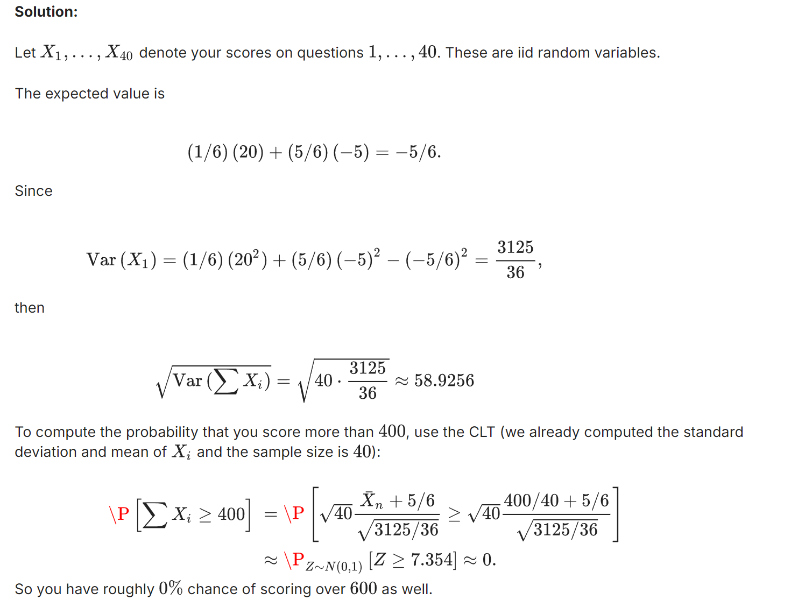

+++
title = 'Lecture 2: Probability Redux'
date = 2024-09-17T00:24:28+08:00
draft = false
math = true
+++

## Two important probability tools



### SAT

Up until 2015, the SAT had a "guessing penalty". Consider an exam with 40 questions each with six possible choices. Only one is correct. Each correct answer is worth +20 points and each incorrect one is worth -5 points. Consider answering each question by rolling a six-sided die for each question and simply choosing the corresponding answer.

1. What is your expected score for the first question?

[Hint: First write your score for this question as `$aX+b$` where `$X \sim \text {Ber}(p)$` for some numbers `$a,b$` and `$p$` to be determined.]

2. What is the standard deviation of your total score on the exam?

3. What is the probability that you score more than 400 points? Use the CLT.

4. What is the probability that you score more than 600 points? Use the CLT.

### Formulations of CLT

Suppose that `$ X_1, \ldots, X_n $` are i.i.d. with mean `$\mu$` and variance `$\sigma^2$`. Which of the following are equivalent statements of the central limit theorem seen in class? (Choose all that apply.)

**Options:**

1. `$\frac{\bar{X}_n - \mu}{\sigma} \to N \left( 0, \frac{\sigma^2}{n} \right)$`

2. `$\sqrt{n} \left( \frac{\bar{X}_n - \mu}{\sigma} \right) \to N(0, 1)$`

3. `$\frac{1}{\sqrt{n}} \sum_{i=1}^{n} (X_i - \mu) \to N(\mu, \sigma)$`

4. `$\frac{\bar{X}_n - \mu}{\sigma} \to N \left(0, \frac{1}{\sqrt{n}} \right)$`

5. `$\sqrt{n} (\bar{X}_n - \mu) \to N(0, \sigma^2)$`

6. `$\frac{1}{\sqrt{n}} \sum_{i=1}^{n} (X_i - \mu) \to N(0, \sigma^2)$`

7. `$\frac{1}{\sqrt{n}} \sum_{i=1}^{n} \left(\frac{X_i - \mu}{\sigma}\right) \to N(0, 1)$`

8. `$\frac{1}{\sqrt{n}} \sum_{i=1}^{n} X_i \to N(\mu, \sigma^2)$`

9. `$\frac{\left(\sum_{i=1}^{n} X_i\right) - n \mu}{\sigma \sqrt{n}} \to N(0, 1)$`

10. `$\frac{\bar{X}_n - \mu}{\sigma} \to N \left(0, \frac{1}{n} \right)$`

---

Solution:

All of the answers with  on the right-hand-side (RHS) are incorrect because the limit on the left is taken as `$n\rightarrow \infty$`. Also the asymptotic variance from the CLT is `$\sigma^2$` and not `$\sigma$`, so the third response is wrong. The eighth answer is wrong as can be seen by calculating the expectation of the left-hand-side and comparing with the right-hand-side mean `$\mu$`. The remaining answers are correct, as can be seen by algebraic manipulations applied to the CLT stated in class.

## (Optional) Hoeffding's Inequality



 
Let `$ X_1, X_2, \ldots, X_n \sim \text{i.i.d.} \, \text{Unif}(0, b) $` be `$ n $` i.i.d. uniform random variables on the interval `$[0, b]$` for some positive `$ b $`.

Using Hoeffding's inequality, which of the following can you conclude to be true? (Choose all that apply.)

1. `$\mathbb{P} \left( \left| \bar{X}_n - \frac{b}{2} \right| \geq \frac{c}{n} \right) \leq 2 e^{-2c^2/b^2} \quad \text{for } n = 3$`

2. `$\mathbb{P} \left( \left| \bar{X}_n - \frac{b}{2} \right| \geq \frac{c}{n} \right) \leq 2 e^{-2c^2/b^2} \quad \text{for } n = 300$`

3. `$\mathbb{P} \left( \left| \bar{X}_n - \frac{b}{2} \right| \geq \frac{c}{\sqrt{n}} \right) \leq 2 e^{-2c^2/b^2} \quad \text{for } n = 5$`

4. `$\mathbb{P} \left( \left| \bar{X}_n - \frac{b}{2} \right| \geq \frac{c}{\sqrt{n}} \right) \leq 2 e^{-2c^2/b^2} \quad \text{for } n = 10$`

5. `$\mathbb{P} \left( \left| \bar{X}_n - \frac{b}{2} \right| \geq c \right) \leq 2 e^{-2c^2/b^2} \quad \text{for } n = 10$`

6. `$\mathbb{P} \left( \left| \bar{X}_n - \frac{b}{2} \right| \geq c \right) \leq 2 e^{-2c^2/b^2} \quad \text{for } n = 10000$`

Answer: 3456

**Solution:**

Given that the `$X_i$`'s are uniform and hence bounded, Hoeffding's inequality applies, with:

`$$ \mathbb{E}[X] = \frac{b}{2}, \text{ and Hoeffding's inequality states:} $$`

`$$ \mathbb{P} \left( \left| \bar{X}_n - \frac{b}{2} \right| \geq \epsilon \right) \leq 2e^{- \frac{2n \epsilon^2}{b^2}} \text{ for all } \epsilon > 0. $$`

The answer choices involve different expressions for `$\epsilon$` and values of $n$. In all cases, `$\epsilon = \frac{c}{n^k}$`:

- For the first two choices: `$k = 1$`
- For the third and fourth choices: `$k = \frac{1}{2}$`
- For the last two choices: `$k = 0$`

Plugging `$\epsilon$` into Hoeffding's inequality:

`$$ \mathbb{P} \left( \left| \bar{X}_n - \frac{b}{2} \right| \geq \frac{c}{n^k} \right) \leq 2e^{- \frac{2n c^2}{b^2 n^{2k}}} = 2e^{- \frac{2c^2}{b^2} n^{1-2k}}. $$`

For `$2k - 1 \leq 0$` in the last four choices (where `$k \leq \frac{1}{2}$`), the probabilities are bounded above by `$2e^{- \frac{2c^2}{b^2}}$`.

**Remark:** Hoeffding's inequality holds for any positive `$n$`, even when `$n$` is small, including the extreme case `$n = 1$`.

## Gaussian distribution



## Properties of the Gaussian distribution



### Transformation and Symmetry

Let `$ X \sim \mathcal{N}(2, 2) $`, i.e., `$ X $` is a Gaussian variable with mean `$\mu = 2$` and variance `$\sigma^2 = 2$`. Let `$ x > 0 $`.  
Write `$ \mathbb{P}(X \geq -x) $` in terms of the CDF `$ \Phi $` of the standard Gaussian variable with a positive argument. In other words, express your answer in terms of `$ \Phi(g(x)) $`, where `$ g(x) $` is a function of `$ x $` that takes only positive values for `$ x > 0 $`.

**Solution:**  
Standardizing `$ X \sim \mathcal{N}(2, 2) $`, we have:

`$$
\frac{X - 2}{\sqrt{2}} \sim \mathcal{N}(0, 1).
$$`

The probability can be rewritten as:

`$$
\mathbb{P}(X \geq -x) = \mathbb{P} \left( \frac{X - 2}{\sqrt{2}} \geq \frac{-x - 2}{\sqrt{2}} \right).
$$`

Using symmetry of the normal distribution:

`$$
\mathbb{P} \left( \frac{X - 2}{\sqrt{2}} \geq \frac{-x - 2}{\sqrt{2}} \right) = \mathbb{P} \left( \frac{X - 2}{\sqrt{2}} \leq \frac{x + 2}{\sqrt{2}} \right) = \Phi \left( \frac{x + 2}{\sqrt{2}} \right).
$$`

Thus, the answer is:

`$$
\mathbb{P}(X \geq -x) = \Phi \left( \frac{x + 2}{\sqrt{2}} \right).
$$`

**Remark:** The symmetry helps to transform the inequality from a negative argument to a positive argument, as required.

## Gaussian Probability Tables and Quantiles



## Modes of Convergence



## Operations on Sequences and Convergence

